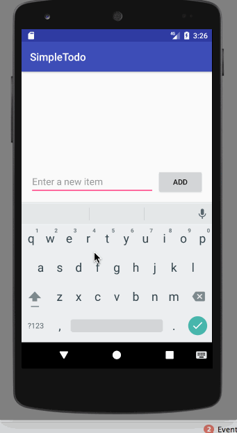

# Pre-work - *SimpleTodo*

**Name of your app** is an android app that allows building a todo list and basic todo items management functionality including adding new items, editing and deleting an existing item.

Submitted by: **Itua Ijagbone**

Time spent: **6** hours spent in total

## User Stories

The following **required** functionality is completed:

* [x] User can **successfully add and remove items** from the todo list
* [x] User can **tap a todo item in the list and bring up an edit screen for the todo item** and then have any changes to the text reflected in the todo list.
* [x] User can **persist todo items** and retrieve them properly on app restart

The following **optional** features are implemented:

* [ ] Persist the todo items [into SQLite](http://guides.codepath.com/android/Persisting-Data-to-the-Device#sqlite) instead of a text file
* [ ] Improve style of the todo items in the list [using a custom adapter](http://guides.codepath.com/android/Using-an-ArrayAdapter-with-ListView)
* [ ] Add support for completion due dates for todo items (and display within listview item)
* [ ] Use a [DialogFragment](http://guides.codepath.com/android/Using-DialogFragment) instead of new Activity for editing items
* [ ] Add support for selecting the priority of each todo item (and display in listview item)
* [ ] Tweak the style improving the UI / UX, play with colors, images or backgrounds

The following **additional** features are implemented:

* [ ] List anything else that you can get done to improve the app functionality!

## Video Walkthrough

Here's a walkthrough of implemented user stories:

GIF created with [LiceCap](http://www.cockos.com/licecap/).

## Project Analysis

As part of your pre-work submission, please reflect on the app and answer the following questions below:

**Question 1:** "What are your reactions to the Android app development platform so far? Compare and contrast Android's approach to layouts and user interfaces in past platforms you've used."

**Answer:** Very good. It's on par with the iOS platform. Layouts are declarative. 

**Question 2:** "Take a moment to reflect on the `ArrayAdapter` used in your pre-work. How would you describe an adapter in this context and what is its function in Android? Why do you think the adapter is important? Explain the purpose of the `convertView` in the `getView` method of the `ArrayAdapter`."

**Answer:** 
- The adapter in this context and in Android, takes the data source (in this case, a list of strings) and maps/adapts it onto a view (in this context, a list view).
- `convertView` in the `getView` gives us the ability if possible to reuse a `View` that was already created without having the need to create a new one. It reduces the memory footprint of having to create a new view each time a view is need especially for a large collection.